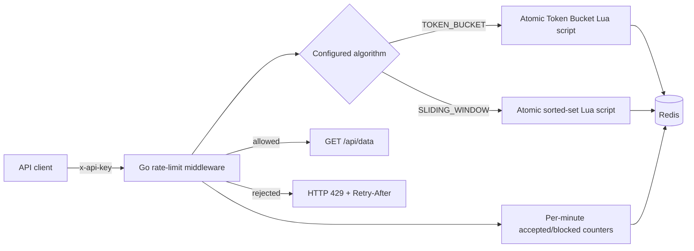

# Distributed API Rate Limiter

A focused Go middleware service that protects an HTTP API with Redis-backed, multi-tier rate limiting. It supports atomic Token Bucket and Sliding Window algorithms, API-key tiers, rolling one-hour traffic metrics, health checks, structured logs, and graceful shutdown.

## Architecture



The Redis scripts perform read, update, expiration, and decision logic atomically. They use Redis server time so multiple application instances share a consistent clock. API keys are SHA-256 hashed before being placed in Redis keys.

## Features

- **Multi-tier limits:** free keys default to 10 requests/minute; premium keys default to 100.
- **Token Bucket:** supports bursts up to the tier capacity and refills continuously.
- **Sliding Window:** counts the precise request timestamps in the trailing configured window.
- **Runtime configuration:** choose an algorithm with `ACTIVE_ALGORITHM` and restart the service.
- **Observability:** `/metrics` aggregates 60 expiring one-minute buckets, avoiding an unbounded event log.
- **Production basics:** atomic Redis operations, fail-open/fail-closed policy, health check, timeouts, JSON logs, non-root container, and graceful shutdown.

## Quick start with Docker

Requirements: Docker Desktop with Docker Compose.

```bash
docker compose up --build
```

In another terminal:

```bash
curl -i -H "x-api-key: free_demo_key" http://localhost:8080/api/data
curl http://localhost:8080/metrics
curl http://localhost:8080/healthz
```

To trigger a `429` with the free tier:

```bash
for i in $(seq 1 12); do curl -s -o /dev/null -w "%{http_code}\n" -H "x-api-key: free_demo_key" http://localhost:8080/api/data; done
```

PowerShell equivalent:

```powershell
1..12 | ForEach-Object {
    try {
        (Invoke-WebRequest -Headers @{ "x-api-key" = "free_demo_key" } http://localhost:8080/api/data).StatusCode
    } catch {
        $_.Exception.Response.StatusCode.value__
    }
}
```

Stop the stack with `docker compose down`. Add `-v` only when you also want to delete the persisted Redis data.

## Run without Docker

Requirements: Go 1.23+ and Redis 7+.

1. Copy `.env.example` to `.env`.
2. Start Redis on `localhost:6379`.
3. Run `go mod tidy` once, then `go run ./cmd/server`.

The service loads a local `.env` automatically. Environment variables set by the host take precedence.

## Configuration

| Variable | Default | Purpose |
|---|---:|---|
| `PORT` | `8080` | HTTP listen port |
| `REDIS_ADDR` | `localhost:6379` | Redis host and port |
| `REDIS_PASSWORD` | empty | Redis password |
| `REDIS_DB` | `0` | Redis database number |
| `ACTIVE_ALGORITHM` | `TOKEN_BUCKET` | `TOKEN_BUCKET` or `SLIDING_WINDOW` |
| `RATE_LIMIT_WINDOW` | `1m` | Go duration used by both algorithms |
| `FREE_LIMIT` | `10` | Free-tier requests per window |
| `PREMIUM_LIMIT` | `100` | Premium-tier requests per window |
| `FREE_API_KEY` | `free_demo_key` | Demo free-tier credential |
| `PREMIUM_API_KEY` | `premium_demo_key` | Demo premium-tier credential |
| `FAIL_OPEN` | `false` | Allow requests if the limit check fails |

Do not use the demo keys in a deployed environment. In a larger system, replace this configuration map with a database or identity-service lookup and cache the tier assignment.

## API

### `GET /api/data`

Requires `x-api-key`. Successful and rate-limited responses include:

- `X-RateLimit-Limit`
- `X-RateLimit-Remaining`
- `X-RateLimit-Tier`
- `X-RateLimit-Algorithm`
- `Retry-After` on HTTP 429 responses

Unknown or missing keys receive HTTP 401. A Redis failure receives HTTP 503 by default; set `FAIL_OPEN=true` if availability is more important than enforcing the limit.

### `GET /metrics`

Public rolling metric snapshot:

```json
{
  "accepted": 450,
  "blocked": 23,
  "total": 473,
  "drop_rate": "4.9%",
  "window": "last_60_minutes"
}
```

Only authenticated requests reaching the limiter are counted. The aggregation uses the current UTC minute plus the previous 59 minute buckets, so it is bounded and minute-granular.

### `GET /healthz`

Returns HTTP 200 when Redis responds and HTTP 503 otherwise.

## Switch algorithms

Set the environment variable and recreate the service:

```bash
ACTIVE_ALGORITHM=SLIDING_WINDOW docker compose up --build --force-recreate
```

In PowerShell:

```powershell
$env:ACTIVE_ALGORITHM = "SLIDING_WINDOW"
docker compose up --build --force-recreate
```

Algorithm changes intentionally require a restart so every replica uses the same configuration. The algorithms use separate Redis key prefixes, preventing incompatible state from being mixed.

## Tests

```bash
go test ./...
go vet ./...
```

The unit tests cover configuration, credential-safe key construction, limiter result parsing, accepted requests, HTTP 429 behavior, unknown credentials, fail-closed behavior, and metrics output. The Redis algorithms themselves are kept in small atomic Lua scripts suitable for integration/load testing against a real Redis instance.

Optional integration tests exercise both Lua scripts against a Redis instance exposed on the host (for example, a separately installed local Redis):

```bash
REDIS_TEST_ADDR=localhost:6379 go test ./internal/limiter -run AgainstRedis
```

## Suggested interview demo

1. Run the free-key loop and show HTTP 429 plus `Retry-After`.
2. Call `/metrics` to show the blocked count and drop rate.
3. repeat with the premium key to demonstrate tiering.
4. Switch to `SLIDING_WINDOW`, recreate the container, and explain the tradeoff: more precise trailing-window enforcement in exchange for more Redis memory than Token Bucket.
